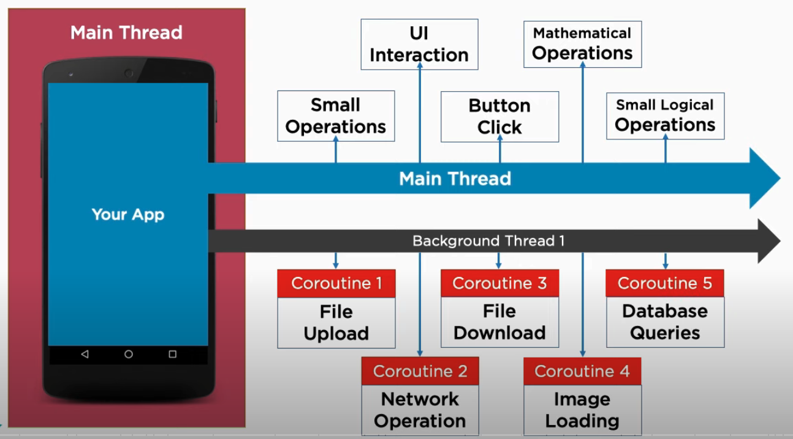

# Kotlin Coroutines:

Kotlin coroutines provide a powerful and lightweight alternative to traditional threads for managing asynchronous code
in your application. They offer a structured approach to concurrency while avoiding the complexity and overhead of
thread management.

However, running coroutines on the main thread requires careful consideration as it can lead to performance issues and
UI freezes if not handled correctly.

## Understanding the Main Thread

The main thread is the primary thread responsible for handling UI interactions and updates in your application. **Any
work done on the main thread should be lightweight and avoid blocking operations** that prevent the thread from
processing other critical tasks. This includes:

* **UI interactions:** Button clicks, scroll events, text input
* **Small math operations:** Simple calculations that complete quickly

**Why Avoid Blocking Operations?**

Heavy operations like file downloads, image loading, and complex network requests can block the main thread, causing
your application to freeze and become unresponsive. This leads to a poor user experience and potential ANRs (Application
Not Responding) errors.

### Background Threads

**Resource Intensive:** Each thread consumes memory and system resources, leading to potential performance bottlenecks
and crashes, especially when creating many threads.

**Context Switching Overhead:** Frequent switching between threads incurs overhead, further impacting performance and
efficiency.

**Complexity Management:** Manually managing numerous threads becomes complex and error-prone, increasing the difficulty
of maintenance and debugging.

**This is where Kotlin coroutines come in as lifesavers!!!**

With Kotlin coroutines, we can utilize a single background thread and launch multiple coroutines on it. Coroutines are
lightweight and highly efficient, allowing us to achieve concurrent and asynchronous operations without the overhead of
managing multiple threads.

<div align="center">
    
</div>

**Be careful Coroutine != Thread**

**For threads:**

The main program starts a background thread and then continues to execute and exit independently. The background thread
will run concurrently with the main thread and eventually exit on its own.:

```kotlin
fun main() { // this: CoroutineScope
    println("Main program starts: ${Thread.currentThread().name}")

    thread {// background thread
        println("Background thread starts: ${Thread.currentThread().name}")
        Thread.sleep(1000) //some async jobs
        println("Background thread ends: ${Thread.currentThread().name}")
    }

    println("Main program ends: ${Thread.currentThread().name}")
}
/* output
Main program starts: main
Main program ends: main
Mock job starts: Thread-0
Mock job ends: Thread-0

Process finished with exit code 0 
 The main thread starts and ends immediately, while the background thread performs a mock job asynchronously and then ends. 
 */
```

[Get full code :part_alternation_mark:](./src/main/kotlin/basics-01.kt)

**For coroutines:**

- While the main thread finishes quickly, the coroutine runs independently on a background thread.
- The main program doesn't wait for the coroutine to finish, allowing the UI to remain responsive.
- This is asynchronous nature of coroutines - they don't block the main thread.

```kotlin
fun main() { // this: CoroutineScope
    println("Main program starts: ${Thread.currentThread().name}")

    GlobalScope.launch {// background coroutine runs on a background thread
        println("Coroutine starts in background: ${Thread.currentThread().name}")
        Thread.sleep(1000) //some async jobs
        println("Coroutine ends in background: ${Thread.currentThread().name}")
    }

    println("Main program ends: ${Thread.currentThread().name}")
}

/*output

Main program starts: main
Main program ends: main

Process finished with exit code 0
 */
```

[Get full code :part_alternation_mark:](./src/main/kotlin/basics-02.kt)

**How can we ensure that the coroutines complete their tasks before we proceed?**

What if I use `delay` instead of `Thread.sleep(1000)`?

```kotlin
fun main() { // this: CoroutineScope
    println("Main program starts: ${Thread.currentThread().name}")

    GlobalScope.launch {//i.e T1
        println("Coroutine starts in background: ${Thread.currentThread().name}")

        delay(1000) // T1 is free - NOT blocked
        println("Coroutine ends in background: ${Thread.currentThread().name}") //T1
    }

    //Blocks the current main thread - NOT a right way atm
    Thread.sleep(1500)
    println("Main program ends: ${Thread.currentThread().name}")//T1 or some other thread
}
/* 
output:
Main program starts: main
Coroutine starts in background: DefaultDispatcher-worker-1
Coroutine ends in background: DefaultDispatcher-worker-1//might be different
Main program ends: main

Process finished with exit code 0
 */
```

[Get full code :part_alternation_mark:](./src/main/kotlin/basics-03.kt)

`Thread.sleep` pauses the **entire thread**, which isn't ideal for coroutines.

By replacing it with `delay(1000)`, we achieve a more efficient and coroutine-friendly approach:

- **Non-blocking:** delay suspends the coroutine only, allowing other coroutines to run concurrently. The main thread
  remains responsive.
- **Lightweight:** Compared to thread creation, coroutines and delay are more resource-efficient.
- **Flexibility:** delay can be cancelled or resumed, offering more control over asynchronous behavior.

While the overall output might seem similar the underlying behavior differs. With `delay`, the main program and the
coroutine execute concurrently, enhancing performance and UI responsiveness.

## Suspend fun

Kotlin coroutines rely on a special function modifier called `suspend` to define coroutine functions which are the
building blocks of asynchronous operations within your coroutines.

**Key characteristics of `suspend fun`:**

- **Can't call directly from the main thread:** They require a coroutine context to be launched within.
- **Can call other suspend fun:** This enables building complex asynchronous workflows by chaining multiple suspendable
  functions.
- **Use await for results:** When waiting for the result of another suspend fun, use await to retrieve it after it
  finishes.

```kotlin
fun main() = runBlocking { // Creates a blocking coroutine scope on the main thread
    println("Main program starts: ${Thread.currentThread().name}") // main: execution within runBlocking

    GlobalScope.launch { // Launches a new coroutine in a global scope, potentially using a background thread
        doSomeDelayedJobs()
    }

    // Blocks the main thread within runBlocking, waiting for the launched coroutine to complete
    delay(1500)
    println("Main program ends: ${Thread.currentThread().name}") // Still main, as runBlocking blocks it
}

```

[Get full code :part_alternation_mark:](./src/main/kotlin/basics-04.kt)

## Coroutines Builders

### What are Coroutine Builders?

Think of them as specialized functions or keywords that streamline coroutine creation and control. Each builder offers
unique ways to launch and orchestrate your coroutines based on your specific needs and threading configurations.

### Common Builders:

<details>
<summary><b>launch</b></summary>
Launches a <i>fire-and-forget</i> coroutine, perfect for background tasks that don't need to return a value. Imagine it as starting a worker drone, sending them off on their mission without expecting a report.

</details>

<details>
<summary><b>async</b></summary>
It launches a coroutine that produces a valuable result later. Once the drone delivers, you use await to retrieve the precious cargo.
</details>

<details>
<summary><b>runBlocking</b></summary>
This builder acts like a temporary roadblock. It creates a blocking coroutine scope, executing all launched coroutines sequentially and keeping the current thread waiting until they finish. However, <b>tread carefully in production code</b>, as it can freeze your UI!
</details>

<details>
<summary><b>coroutineScope</b></summary>
Similar to runBlocking, but without the roadblock. This builder creates a non-blocking scope, letting your coroutines run freely while keeping an eye on them. Use it to launch multiple tasks and patiently wait for all to complete before moving on.
</details>

<details>
<summary><b>withContext</b></summary>
Need to send your coroutine on a specific mission? This builder is your travel agent. It allows you to switch the current coroutine's context, choosing a different dispatcher like a background thread or even the main thread.
</details>

### Why are Builders Important?

They're guardians of clean and efficient code. They promote structure, avoid the complexities of manual thread
management, and unlock the true potential of asynchronous programming.

### Launch

```kotlin
// Creates coroutines at global level(app)
// Do NOT use if it is not mandatory
GlobalScope.launch {
    // file download
    // play music
}

// Launch within a specific scope (e.g., runBlocking, coroutineScope) for better control and lifecycle management.
launch {
    // login operation
    // some data computation
}
```

`launch` The launched coroutine inherits the dispatcher and cancellation behavior of the parent scope. This approach
provides better control and avoids potential memory leaks.

```kotlin
fun main() = runBlocking { // Creates a blocking coroutine scope on the main thread
    println("Main program starts: ${Thread.currentThread().name}") // main thread

    val someDelayedJob: Job = launch { // main -inherit from immediate parent
        doSomeDelayedJobs()
    }

    someDelayedJob.join()//Suspends the coroutine until this job is complete!!!

    println("Main program ends: ${Thread.currentThread().name}") // Still main, as runBlocking blocks it
}
/* output:
Main program starts: main
Coroutine starts: main
Coroutine ends: main
Main program ends: main
 */

```

[Get full code :part_alternation_mark:](./src/main/kotlin/basics-05.kt)

`launch` returns a job object so that we can wait for that job using `.join()` or we can `cancel` it.

### Async : Concurrency with Return Values

- `async` is similar to `launch` but designed for coroutines that **return a value**.
- **Inherits parent scope:** similar to `launch` inherits from the parent scope's cancellation behavior and dispatcher,
  ensuring proper lifecycle management.
- **Returns `Deferred`:** it represents the eventual result-similar to `javaScript promise`
- **Suspends with `await`:** Use `await` on the `Deferred` to pause the current coroutine until the result is available,
  enabling asynchronous waiting without blocking the thread.

```kotlin
fun main() = runBlocking { // Creates a blocking coroutine scope on the main thread
    println("Main program starts: ${Thread.currentThread().name}") // main thread

    val someDelayedDeferred: Deferred<String> = async {
        doSomeDelayedJobs()//will return some string data
    }
    // Main program continues without blocking

    val someData = someDelayedDeferred.await() // Suspends until result is ready

    println("Data returned from server: $someData")

    println("Main program ends: ${Thread.currentThread().name}") // Still main, as runBlocking blocks it
}
/*
Main program starts: main
Coroutine starts: main
Coroutine ends: main
Data returned from server: Hello world!!!
Main program ends: main
 */
```

[Get full code :part_alternation_mark:](./src/main/kotlin/basics-06.kt)

### runBlocking: Blocking Coroutines for Limited Use Cases

While runBlocking offers a convenient way to launch coroutines, **use it cautiously** as it blocks the current thread
until all launched coroutines within it complete.

This can negatively impact UI responsiveness in production code.

**Primary Use Cases:**

**_Testing:_** `runBlocking` is valuable for testing suspend functions in a synchronous manner, allowing assertions and
verifications within the same scope.

```kotlin
private suspend fun mySuspendFun(): String {
    // Other logic
    delay(5000)
    return "Hello world!"
}
internal class SampleTest {
    @Test
    fun testSum() = runBlocking {
        val expected = "Hello world!"
        val actual = mySuspendFun()// wait for data

        assertEquals(expected, actual)
    }
}

```

[Get full code :part_alternation_mark:](./src/test/kotlin/SampleTest.kt)

**_N.B :_** We can
use [runTest](https://kotlinlang.org/api/kotlinx.coroutines/kotlinx-coroutines-test/kotlinx.coroutines.test/run-test.html)
for a more robust testing experience-the code runs will skip delays .

### Cancelling coroutine execution

**Cancel background coroutines when necessary.**

In a long-running application you might need fine-grained control on your background coroutines. For example, a user
might have closed the page that launched a coroutine and now its result is no longer needed and its operation can be
cancelled.

Coroutine cancellation is **cooperative**. A coroutine code has to cooperate to be cancellable. But what does
_cooperative_ mean?

- In coroutine cancellation, the coroutine itself needs to check for a cancellation
- All the suspending functions -`delay` `yield` `withContext`etc - in `kotlinx.coroutines` are **cancellable**.
- They check for cancellation of coroutine and throw `CancellationException` when cancelled.

```kotlin
    println("Main program starts: ${Thread.currentThread().name}") // main thread

val myCancellableJob = launch {
    try {
        doSomeDelayedJobs() //actual long-running work
    } catch (e: CancellationException) {
        println(e) //handle efficiently
    } finally {
        println("job: I'm running finally")
    }
}
waitForTimes(1300L)
println("main: I'm tired of waiting!")
myCancellableJob.cancelAndJoin() // myCancellableJob will throw an `CancellationException` which handled in the catch block
println("main: Now I can quit.")

println("Main program ends: ${Thread.currentThread().name}")

```

[Get full code :part_alternation_mark:](./src/main/kotlin/basics-07.kt)

#### Using `yield` in Coroutines:

The yield function is a suspending function used within a coroutine. It allows coroutines on the same dispatcher to run.

```kotlin
println("Main program starts: ${Thread.currentThread().name}") // main thread

val job = launch {
    try {
        for (i in 0..500) {
            println("Non delay job: I'm job $i ...")
            yield()// Without yield we can not cancel the job until it finish it
        }
    } catch (e: CancellationException) {
        println(e)
    } finally {
        println("job: I'm running finally")
    }
}
delay(2)
println("main: I'm tired of waiting!")
job.cancelAndJoin()
println("main: Now I can quit.")
println("Main program ends: ${Thread.currentThread().name}")
```

[Get full code :part_alternation_mark:](./src/main/kotlin/basics-08.kt)

#### Using `isActive` in Coroutines:

Returns `true` when the current **Job** is still **active** (has **_not completed_** and was **_not cancelled_** yet).

Check this property in `long-running computation loops` to support cancellation:

```kotlin
 val job = launch(Dispatchers.Default) {//we will cover Dispatchers soon
    var someJob = 0
    while (isActive) {
        //we don't need to use delay/yield
        println("Non delay job: I'm job ${someJob++}...")
    }
}
delay(2)
println("main: I'm tired of waiting!")
job.cancelAndJoin()
println("main: Now I can quit.")
println("Main program ends: ${Thread.currentThread().name}")

```

[Get full code :part_alternation_mark:](./src/main/kotlin/basics-09.kt)

### Timeouts

Similar to launch ans async functions, `withTimeout` and `withTimeoutOrNull` functions are coroutine builders.

The most obvious practical reason to cancel execution of a coroutine is because its execution time has exceeded some
timeout.
You can manually track the reference to the corresponding `Job` and `launch` a separate coroutine to `cancel` the
tracked one after `delay`.

However there is a **_ready_** to use `withTimeout` function that does it.

`withTimeOut` : Runs a given suspending block of code inside a coroutine with a specified timeout and throws a
TimeoutCancellationException if the timeout was exceeded.

```kotlin
withTimeout(1200) {
    try {
        doSomeDelayedJobs()
    } catch (ex: TimeoutCancellationException) { // It will throw TimeoutCancellationException
        println("TimeoutCancellationException: $ex")
    } finally {
        println("job: I'm running finally")
    }

    // Program will crash before here!
}
```

[Get full code :part_alternation_mark:](./src/main/kotlin/basics-10.kt)

`withTimeoutOrNull`: Runs a given suspending block of code inside a coroutine with a specified timeout and
returns `null` if this timeout was exceeded. If the given timeMillis is non-positive, null is returned immediately.

```kotlin
  val someData: String? = withTimeoutOrNull(1200) {//Returns data from fun or null
    doSomeDelayedJobs()
}
// Program will NOT crash before here!
println("The return data is $someData")
```

[Get full code :part_alternation_mark:](./src/main/kotlin/basics-11.kt)

## Composing suspending functions

### Sequential by default

Coroutine is **_sequential_** by default.

In practice, we do this if we use the result of the _first_ function to make a decision on whether we need to invoke the
_second_ one or to decide on how to invoke it.

```kotlin
  val totalTime = measureTimeMillis {
    val msg1 = doSomeDelayedJobsOne()
    val msg2 = doSomeDelayedJobsTwo() // will run sequential
    println("Return data: ${msg1 + msg2}")
}
println("Total time is: $totalTime")// msg1 time + msg2 time
```

[Get full code :part_alternation_mark:](./src/main/kotlin/basics-12.kt)

### Concurrent using async

if there are **no dependencies** between invocations of `doSomeDelayedJobsOne` and `doSomeDelayedJobsTwo` and we want to
get the answer _faster_, by doing both concurrently? This is where `async` comes to help.

`async` is just like `launch`. It starts a _separate_ coroutine which is a light-weight thread that works **concurrently
** with all the other coroutines.

**The difference:**

- `launch` returns a `Job` and does not carry _any resulting value_,
- `async` returns a `Deferred` — a light-weight non-blocking future that represents a `promise` to provide a result
  later.
- You can use `.await()` on a _deferred_ value to get its eventual result,
- `Deferred` is also a `Job`, so you can **_cancel_** it if needed.

```kotlin
 val totalTime = measureTimeMillis {
    val msg1: Deferred<String> = async { doSomeDelayedJobsOne() }
    val msg2: Deferred<String> = async { doSomeDelayedJobsTwo() } // will run concurrent manner
    println("Return data: ${msg1.await() + msg2.await()}")
}
println("Total time is: $totalTime")// ~longest one
```

This is twice as fast, because the two coroutines execute concurrently. Note that concurrency with coroutines is always
explicit.

[Get full code :part_alternation_mark:](./src/main/kotlin/basics-13.kt)

### Lazily started async

Optionally, `async` can be made `lazy` by setting its start parameter to `CoroutineStart.LAZY`.

In this mode it **_only starts_** the coroutine when its result is **_required_** by `await`, or if its Job's start
function is invoked.

```kotlin
{
    val msg1: Deferred<String> = async(start = CoroutineStart.LAZY) { doSomeDelayedJobsOne() }
    val msg2: Deferred<String> = async(start = CoroutineStart.LAZY) { doSomeDelayedJobsTwo() }
    val msg3: Deferred<String> = async(start = CoroutineStart.LAZY) { doSomeUnnecessaryDelayedJobs() }
    //some other logic
    msg1.start()
    msg2.start()
    // we don't need to invoke the msg3
    println("Return data: ${msg1.await() + msg2.await()}")
}
```

[Get full code :part_alternation_mark:](./src/main/kotlin/basics-14.kt)

We have control on when exactly to start the execution by calling `start`.
Note that if we just call `await` in println **without** first calling `start` on individual coroutines, this will lead
to **_sequential behavior_**, since `await` starts the coroutine execution and _waits_ for its finish, which is not the
intended use-case for laziness.